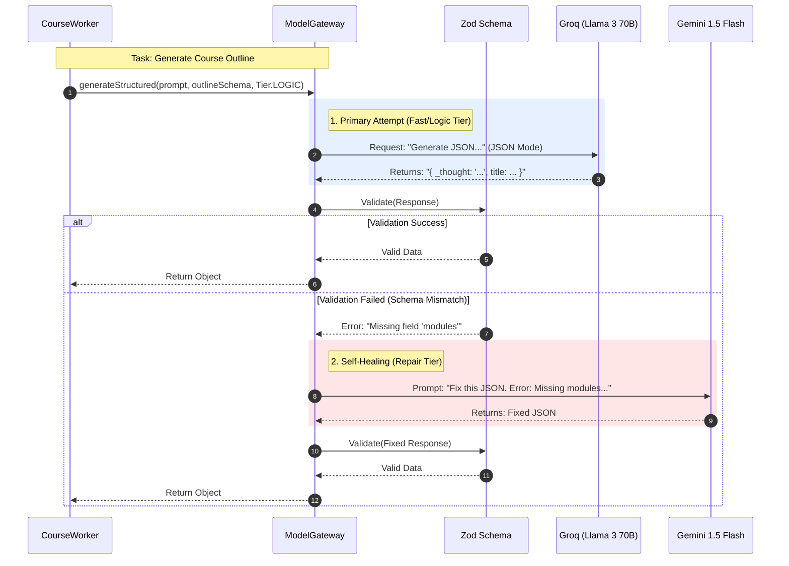

# AI Orchestration & The Model Gateway

This module is the intelligence layer. It abstracts away the specific provider (OpenAI, Groq, Google) and focuses on **Task Tiers**. It also implements a "Self-Healing" mechanism to guarantee valid JSON, even when the AI hallucinates.

#### 1. The AI Orchestration Diagram



#### 2. Technical Strategy: Smart Tiering & Self-Healing

The `ModelGateway` does not just call one model. It routes tasks based on cost/complexity and fixes errors automatically.

**A. Task Tiers (The Routing Logic)**
Instead of hardcoding models, we use functional tiers. This allows us to swap models (e.g., swapping OpenAI for Groq) without changing business logic.

* **`LOGIC_REASONING`** (Llama 3.3 70B via Groq):
* **Use Case:** Complex structural planning (Course Outlines, Code Logic).
* **Why:** High reasoning capability, good instruction following, low latency.


* **`CREATIVE_WRITING`** (Llama 3.3 70B via Groq):
* **Use Case:** Writing lesson content, analogies, and explanations.
* **Why:** Nuanced prose, less robotic than GPT-3.5.


* **`FAST_UTILITY`** (Llama 3.1 8B via Groq):
* **Use Case:** Summarizing search results, extracting keywords.
* **Why:** Sub-second latency, extremely cheap.


* **`JSON_REPAIR`** (Gemini 1.5 Flash):
* **Use Case:** The "Fallback" surgeon.
* **Why:** Massive context window (1M tokens) allows it to ingest a broken JSON dump and a validation error to rewrite it correctly.


**B. The Self-Healing Loop**
LLMs often output "almost" correct JSON (e.g., trailing commas, missing keys).

1. **Generate:** The Gateway forces `jsonMode` on the primary model.
2. **Validate:** The output is passed to `Zod`.
3. **Catch:** If `Zod` throws an error, we **do not** crash.
4. **Heal:** We catch the error, feed the *broken JSON* + *Zod Error Message* into the **Repair Tier** (Gemini), instructing it to "Fix the syntax."

#### 3. Data Structure: Chain-of-Thought (CoT)

We force the model to "think" before it "speaks" by adding a `_thought` field to our Zod schemas.

* **The Problem:** If you ask an LLM for JSON immediately, it commits to a structure before planning the content.
* **The Solution:**
```typescript
export const outlineSchema = z.object({
  _thought: z.string().describe("Internal reasoning for the course structure"),
  title: z.string(),
  // ... rest of schema
});

```


* **The Effect:** The model writes its plan in `_thought` ("I should start with basics, then move to advanced..."), which significantly improves the logical flow of the subsequent `modules` array.

---