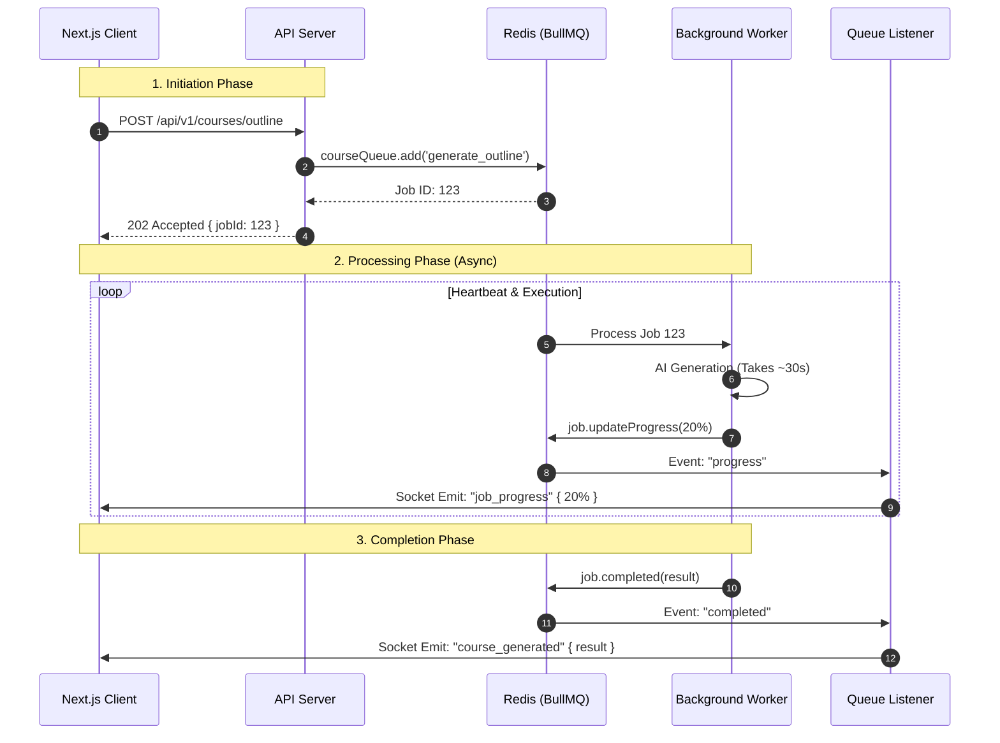

# The Asynchronous Event Loop

In a standard web app, a request like "Generate Course" would time out after 60 seconds. To solve this, **CourseForge** decouples the *Request* from the *Execution*.

#### 1. The Real-Time Sequence Diagram

This flow shows how a job travels from the User to the Worker and how updates travel back via a separate channel (Sockets).

#### 2. Technical Deep Dive: The "Double-Loop" Architecture

You implemented a sophisticated separation of concerns here. The **Worker** never talks to the **Client** directly. This is critical for scaling (e.g., if you have 10 workers and 1 API server).

**A. The Trigger (Fire-and-Forget)**

* **File:** `courseController.ts`
* **Logic:** The API validates the user's credits, calculates the cost, and pushes the job to Redis. It immediately returns a `jobId` to the client so the browser doesn't hang.

**B. The Processor (Isolated Worker)**

* **File:** `courseWorker.ts`
* **Logic:** The worker is a "dumb" processor. It doesn't know about HTTP responses or Websockets. It simply runs the AI logic and updates the job's status in Redis using `job.updateProgress()`.
* **Heartbeat:** You implemented a `setInterval` heartbeat that artificially increments progress (5%... 10%...) while the AI is thinking, ensuring the UI never feels "frozen".

**C. The Relay (Queue Listener)**

* **File:** `queueListener.ts`
* **Logic:** This component sits on the API server side. It subscribes to global BullMQ events (`progress`, `completed`, `failed`).
* **Bridge:** When it sees a progress update in Redis, it grabs the `userId` from the job data and uses `socketService.emitToUser` to send the payload to the specific user's room.

**D. The Transport (Socket Service)**

* **File:** `socketService.ts`
* **Logic:** Using the `@socket.io/redis-adapter`, this service ensures that even if you have multiple API instances (horizontal scaling), the socket event finds the correct user connection.

---
