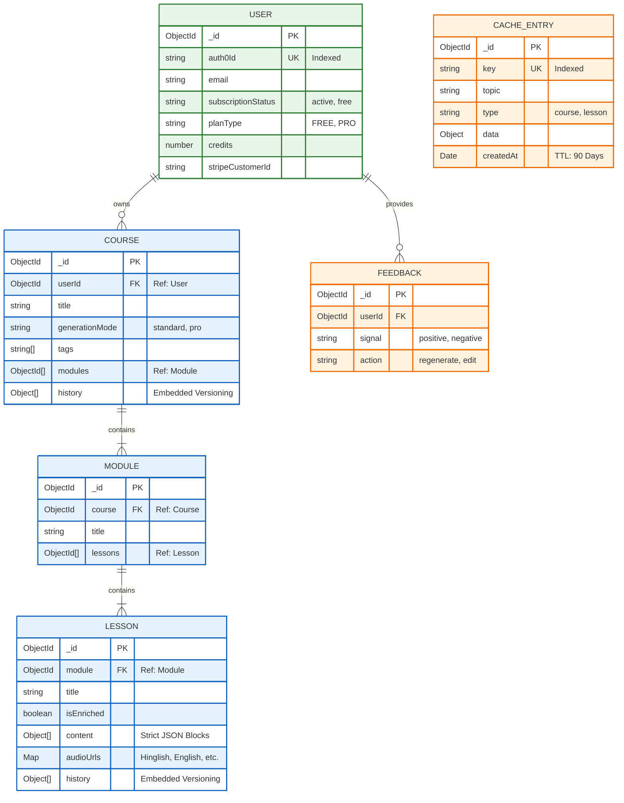

# Data Layer & Schema Design

#### 1. The Entity Relationship Diagram (ERD)

This diagram visualizes how the core content links to the user and how the caching layer sits alongside it.

#### 2. Technical Design Decisions

**A. The Content Hierarchy (Referencing Strategy)**

* **Structure:** `Course`  `Module`  `Lesson`.
* **Design Choice:** You used **References** (storing `_id` arrays) instead of embedding everything inside the Course document.
* **Why:**
1. **Scalability:** A course with 50 lessons and generated video/audio metadata could easily exceed MongoDB's 16MB document size limit.
2. **Lazy Loading:** The frontend can load the `Course` outline instantly without fetching the heavy `content` of every lesson.

**B. Version Control (Embedding Strategy)**

* **Field:** `history` array in `Course` and `Lesson`.
* **Design Choice:** You embedded the history directly within the document.
* **Why:**
1. **Atomicity:** When a user clicks "Regenerate," you save the *new* content and push the *old* content to history in a single ACID transaction.
2. **Snapshotting:** It allows users to toggle between "Standard" and "Pro" versions of a specific lesson instantly.

**C. The Semantic Cache (TTL Strategy)**

* **Entity:** `CacheEntry`.
* **Feature:** `createdAt: { type: Date, expires: "90d" }`.
* **Why:** MongoDB handles the cleanup automatically. You don't need a cron job to delete old cache entries; the database removes them after 90 days to save storage costs.

**D. Polymorphic Lesson Content**

* **Field:** `content` in `Lesson`.
* **Structure:** An array of mixed objects (`HeadingBlock | VideoBlock | CodeBlock`) validated by Zod schemas in the application layer.
* **Why:** This is superior to storing raw HTML strings. It allows the frontend to render native React components (e.g., a runnable Code Editor for `type: 'code'`) rather than using dangerous `dangerouslySetInnerHTML`.

---
