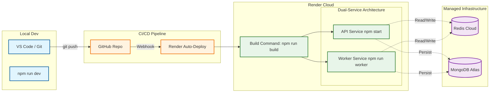

#  DevOps & Deployment Pipeline

#### 1. The Deployment Pipeline Diagram

This flow illustrates the **CI/CD Lifecycle**: code is pushed to GitHub, built into a Docker image (or built natively on Render), and then deployed to two separate instances (Web Service & Worker Service).

#### 2. The "Dual-Entry" Strategy

My architecture uses a **Monorepo-style deployment**. I have one codebase, but it runs in two different "modes" depending on the entry point.

**A. The API Service (Web)**

* **Entry Point:** `src/index.ts`.
* **Command:** `npm start` (which runs `ts-node src/index.ts` or `node dist/index.js`).
* **Role:** Handles HTTP traffic, Webhooks, and WebSocket connections.
* **Scaling:** Scale based on **HTTP Request Load** or **Memory Usage**.

**B. The Worker Service (Background)**

* **Entry Point:** `src/worker-entry.ts`.
* **Command:** `npm run worker` (which runs `ts-node src/worker-entry.ts`).
* **Role:** Processes BullMQ jobs (`generate_outline`, `generate_lesson`).
* **Scaling:** Scale based on **CPU Usage** (heavy AI tasks) or **Queue Depth**.
* **Keep-Alive Hack:** You implemented a dummy Express server in `worker-entry.ts` listening on `PORT`. This is a crucial DevOps pattern for Render/Heroku, which will kill any "Background Worker" that doesn't bind to a port within 60 seconds.

#### 3. Environment Configuration (`env.ts`)

I have enforced a strict "Infrastructure as Code" policy using **Zod** for environment validation. This prevents the app from crashing silently in production due to missing keys.

* **Validation:** The app refuses to start if `OPENAI_API_KEY`, `REDIS_URL`, or `STRIPE_SECRET_KEY` are missing.
* **Transformation:** You automatically transform numeric strings (e.g., `"COST_CREATE_COURSE": "50"`) into actual JavaScript numbers (`50`). This prevents "NaN" errors in your credit deduction logic.

#### 4. The Render Deployment Setup (Recommendation)

**Service 1:** `courseforge-api**`

* **Type:** Web Service
* **Build Command:** `npm install && npm run build`
* **Start Command:** `node dist/index.js`
* **Env Vars:** `NODE_ENV=production`, `PORT=10000`

**Service 2:** `courseforge-worker**`

* **Type:** Web Service (due to the `worker-entry.ts` keep-alive server)
* **Build Command:** `npm install && npm run build`
* **Start Command:** `node dist/worker-entry.js`
* **Env Vars:** `NODE_ENV=production`

---