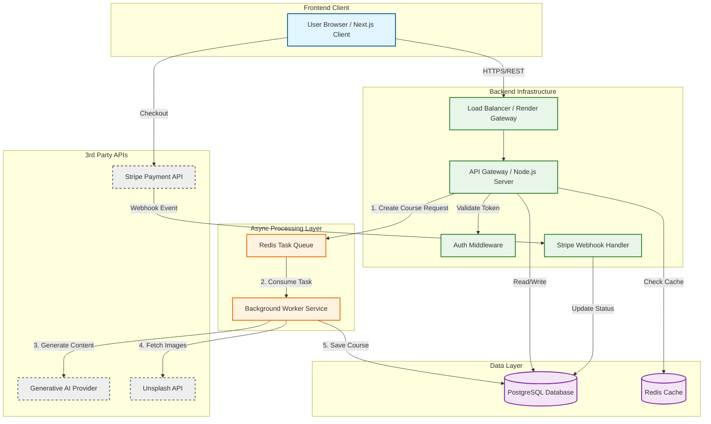

This is a comprehensive documentation strategy. Since I don't have your specific files yet, I will design this based on the robust architecture we discussed (Next.js, Node.js, Redis, Workers, Stripe, Docker, Render, GenAI).

Here is the **Master Plan** to generate your documentation. I will present **Phase 1 (The HLD)** immediately below.

### 📋 The Documentation Master Plan

* **Phase 1: System Overview (HLD)**
* **Deliverable:** System Architecture Diagram (Client  API  Async Workers).
* **Content:** High-level component interaction.

* **Phase 2: Core Intelligence (AI & Workflow)**
* **Deliverable:** AI Orchestration Diagram & User Workflow Flowchart.
* **Content:** Deep dive into the Prompt Chain, Unsplash integration, and user journey.

* **Phase 3: Data Layer (Persistence)**
* **Deliverable:** Database ERD (Entity Relationship Diagram).
* **Content:** Schema design for Users, Courses, Modules, and Subscriptions.

* **Phase 4: DevOps & Deployment Strategy**
* **Deliverable:** Docker Lifecycle Diagram (Dev  Test  Prod) & CI/CD Pipeline.
* **Content:** How code moves from local VS Code to Render via Docker and Git hooks.

---

### Phase 1: High-Level Design (HLD)

This section provides the "Big Picture" for recruiters and senior engineers. It demonstrates that **CourseForge** is an event-driven distributed system, not just a monolith.

#### 1. The HLD Diagram

#### 2. README: System Architecture

**Project:** CourseForge
**Architecture Style:** Event-Driven / Micro-service capable
**Infrastructure:** Render (PaaS), Docker

**Component Breakdown:**

1. **Client Layer (Next.js):**
* Acts as the entry point. Handles user authentication and initiates course generation requests.
* Communicates via secure REST APIs.

2. **API Gateway (Node.js/Express):**
* **Role:** The traffic controller. It validates requests, handles authentication, and routes complex tasks to the background.
* **Optimization:** Does *not* block the main thread for AI generation. Instead, it pushes a job ID to the client and delegates the work.

3. **Async Processing Layer (Redis + Workers):**
* **Redis Queue:** Buffers incoming high-compute requests (GenAI calls). acts as a shock absorber during high traffic.
* **Workers:** Isolated Node.js processes that consume jobs. They handle the "heavy lifting"—chaining AI prompts and fetching Unsplash images—ensuring the API remains responsive.

4. **External Integrations:**
* **Generative AI:** Provides the raw intelligence for curriculum structuring.
* **Unsplash:** Adds visual context to the text-based modules.
* **Stripe:** Manages the subscription lifecycle via secure webhooks.

---

**Would you like me to proceed to Phase 2 (AI Orchestration & Workflow)?**