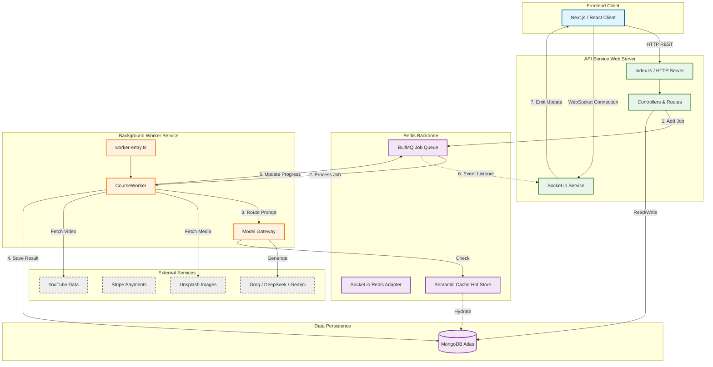

# High-Level System Architecture (HLD)

#### 1. The Architecture Diagram

#### 2. System Overview

**Project:** CourseForge
**Architecture:** Event-Driven Microservices
**Infrastructure:** Render (PaaS), Docker, Redis

**Core Components:**

1. **API Service (`index.ts`):**
* **Role:** The entry point for all user traffic. It handles Authentication (`authMiddleware`), Payment Webhooks (`paymentRoutes`), and Request Validation.
* **Efficiency:** Uses `compression` and `helmet` for performance and security.
* **Non-Blocking:** It never executes AI tasks directly. Instead, it offloads them to the `JobQueue` immediately.

2. **The Redis Backbone:**
* **BullMQ:** Acts as the buffer between the API and the Worker. Allows the system to handle traffic spikes without crashing.
* **Pub/Sub Adapter:** The `SocketService` uses `redis-adapter` to allow the detached Worker to send real-time alerts to the API server.

3. **Worker Service (`worker-entry.ts`):**
* **Role:** A dedicated Node.js process that listens for heavy compute jobs.
* **Isolation:** Runs independently from the API. If the AI processing crashes, the web server stays alive.
* **Orchestration:** Manages the complex flow of calling AI, fetching images, and saving to the DB.

4. **Hybrid Caching Strategy (`SemanticCache`):**
* **Hot Store (Redis):** Stores recent course outlines for 1 hour for <5ms retrieval.
* **Cold Store (MongoDB):** Persists cache entries for 90 days.
* **Benefit:** Reduces AI costs and latency for popular topics.

---
